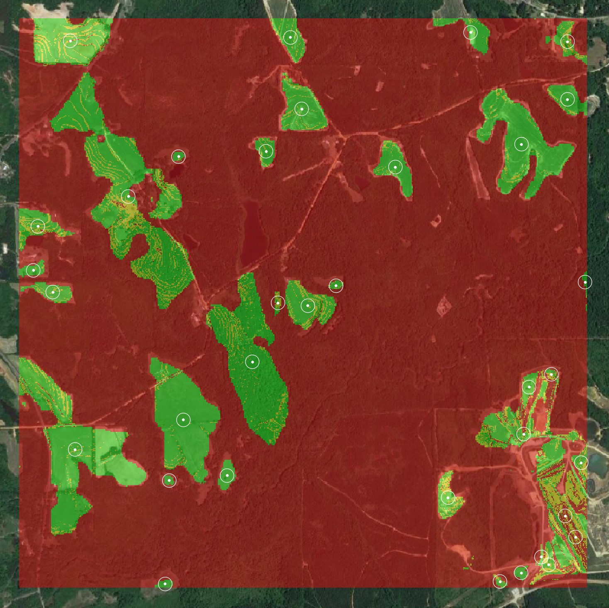
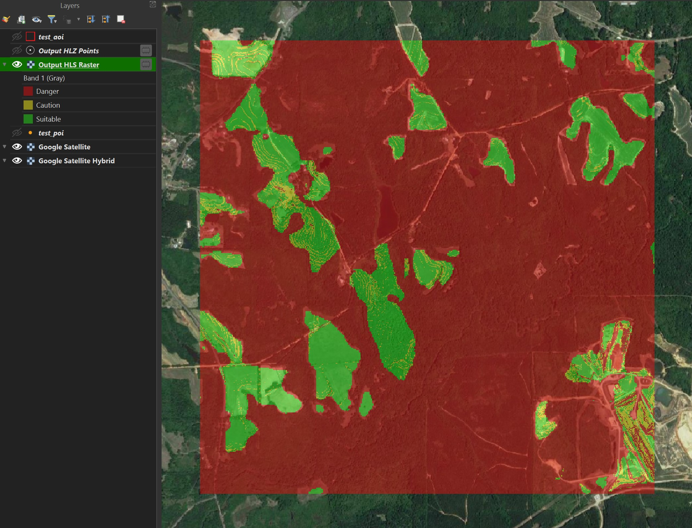
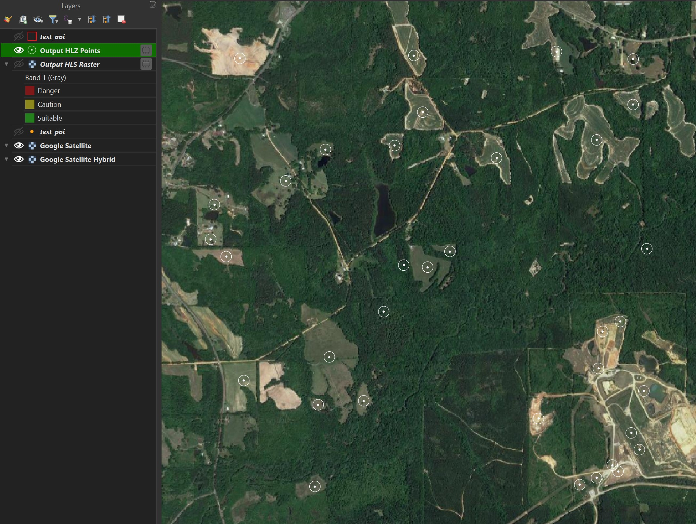
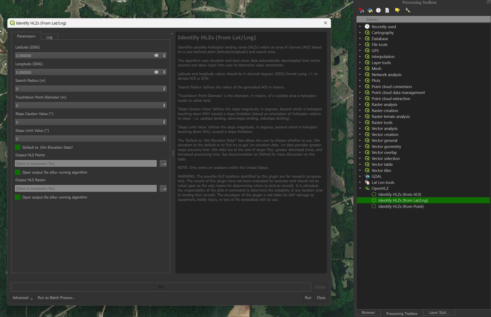
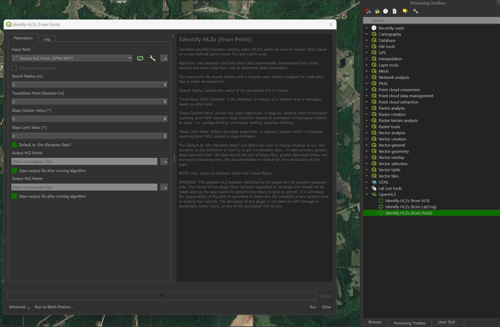
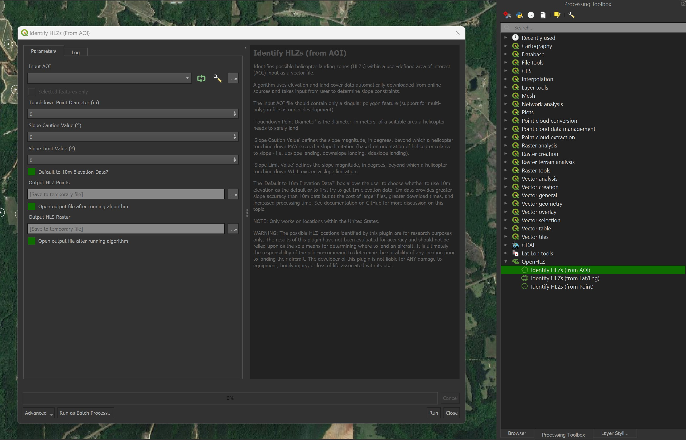

# OpenHLZ: An Open-Source HLZ Identification Toolkit

***OpenHLZ*** allows users to quickly identify possible helicopter landing zones (HLZs) anywhere within the United States.  Using a user-defined area of interest (AOI), this model automatically downloads the required data needed to identify HLZs that meet the criteria defined by the user.

## Basic Structure

The basic structure of ***OpenHLZ*** is discussed below, to include the model parameters, data sources, and methodology.

### Parameters
***OpenHLZ*** uses both user-defined parameters (slope magnitude and touchdown point (TDP) size) and pre-defined parameters (land use/land cover (LULC) classification) in its model.

* ***Slope -*** Helicopters have certain slope limitations they have to abide by when touching down to land.  These limits, often expressed in degrees, are different based on the orientation of the helicopter relative to the slope (i.e. landing upslope, downslope, or sideslope).  Therefore, this model allows users to define *caution* and *limit* values based on the limitations of their own aircraft.  The *caution* value should correspond to the *most* restrictive (shallowest/lowest magnitude) slope limit and the *limit* value to the *least* restrictive (steepest/greatest magnitude).  This will result in the following range of slope values:
  * Slope values less than the *caution* value that *should* be suitable for landing.
  * Slope values between the *caution* and *limit* values that *may* be suitable for landing.
  * Slope values greater than the *limit* value that *will not* be suitable for landing.

 * ***TDP Size -*** All helicopters need a minimum sized area to safely land.  Users can define this within the model as the diameter of the TDP size their aircraft requires.

 * ***LULC Classification -*** The surface conditions of a possible landing zone are important to consider and may limit the ability of a helicopter to land.  This model accounts for this by using LULC data to remove areas that would generally not be suitable to land a helicopter (i.e. water or trees).  Since these constraints are mostly universal, they are pre-defined in the model to make it simpler for the user (more on this below).

### Data Sources
***OpenHLZ*** automatically downloads publicly available digital elevation model (DEM) and LULC data based on user inputs.  These data come from online repositories and therefore necessitate an internet connection while using this model.

* ***DEM Data -*** This model uses DEM data from [The National Map Downloader](https://apps.nationalmap.gov/downloader/) to calculate the necessary slope data.  It will first try to download [1m DEM data](https://www.sciencebase.gov/catalog/item/543e6b86e4b0fd76af69cf4c) (unless otherwise specified by the user) and if unable to find any will then attempt to download [1/3 arcsecond data](https://www.sciencebase.gov/catalog/item/4f70aa9fe4b058caae3f8de5) (nominally 10m).  The advantages of using 1m data are increased accuracy and obstruction detection but this comes at the cost of greater file sizes and increased download and analysis times.  Therefore, the user can opt to default to 10m data.

* ***LULC Data -*** LULC data from ESRI's Living Atlas project are used to determine surface condition suitability.  These data come from the [Sentinel-2 10-Meter Land Use/Land Cover](https://livingatlas.arcgis.com/landcover/) dataset that is generated using AI classification and is updated annually.  In the ***OpenHLZ*** model, pixels that are classified as 'rangeland' or 'bare ground' in the LULC dataset are identified as *suitable* while all other LULC classes are considered *unsuitable*.

### Methodology
The identification methodology for this model has been adapted from the study [*Evaluating the relationship between data resolution and the accuracy of identified helicopter landing zones (HLZs)*](https://www.sciencedirect.com/science/article/pii/S0143622822000236) by Erskine et al.  The below description will be brief, so please view the methodology section of the linked study for a more in-depth explanation.

* **1. Initial Setup -** The model takes the user input and, if necessary, generates an AOI based on the input latitude/longitude coordinate or point file.

* **2. Download the Data -** The model takes the AOI and determines which DEM and LULC data intersect it.  It then automatically downloads these data.

* **3. Mosaic and Clip the Data -** Since the downloaded DEM and LULC data are often in multiple tiles, these must be mosaiced together before the analysis can be done.  Additionally, the data often extend beyond the bounds of the AOI, so any extraneous data are clipped and removed.

* **4. Calculate the HLS Raster -** An important step in identifying HLZs is generating a helicopter landing suitability (HLS) raster.  This involves calculating and reclassifying the slope data and reclassifying the LULC data based on the model parameters.  These reclassified rasters are then used to calculate a final HLS raster that shows areas (at the pixel level) suitable to land a helicopter.  See the example below for a visual depiction.

 

* **5. Identify Possible HLZs -** First, the suitable areas in the HLS raster are converted into polygon features.  Then, features that are too small to land a helicopter are removed (based on the TDP size parameter).  Finally, the centroids of the remaining polygons are calculated and returned as possible HLZs.

## Using the Included Tools

The included tools in the ***OpenHLZ*** toolbox all do essentially the same thing but take different inputs to determine the AOI.

###  Identify HLZs (from Lat/Lng)

This tool identifies possible HLZs based on a user-defined point (latitude/longitude) and search radius.

* ***Latitude*** and ***longitude*** values should be in decimal degrees (DDG) format using +/- to denote N/S or E/W.
* ***Search Radius*** defines the radius of the generated AOI in meters.
* ***Touchdown Point Diameter*** is the diameter, in meters, of a suitable area a helicopter needs to safely land.
* ***Slope Caution Value*** defines the slope magnitude, in degrees, beyond which a helicopter touching down MAY exceed a slope limitation.
* ***Slope Limit Value*** defines the slope magnitude, in degrees, beyond which a helicopter touching down WILL exceed a slope limitation.
* The ***Default to 10m Elevation Data?*** box allows the user to choose whether to use 10m elevation as the default or to first try to get 1m elevation data.

###  Identify HLZs (from Point)

This tool identifies possible HLZs based on a user-defined point (vector file) and search radius.

* ***Input Point*** can be in any vector point format.
* ***Search Radius*** defines the radius of the generated AOI in meters.
* ***Touchdown Point Diameter*** is the diameter, in meters, of a suitable area a helicopter needs to safely land.
* ***Slope Caution Value*** defines the slope magnitude, in degrees, beyond which a helicopter touching down MAY exceed a slope limitation.
* ***Slope Limit Value*** defines the slope magnitude, in degrees, beyond which a helicopter touching down WILL exceed a slope limitation.
* The ***Default to 10m Elevation Data?*** box allows the user to choose whether to use 10m elevation as the default or to first try to get 1m elevation data.

###  Identify HLZs (from AOI)

This tool identifies possible HLZs based on a user-defined AOI (vector file).

* ***Input AOI*** can be in any vector polygon format.
* ***Touchdown Point Diameter*** is the diameter, in meters, of a suitable area a helicopter needs to safely land.
* ***Slope Caution Value*** defines the slope magnitude, in degrees, beyond which a helicopter touching down MAY exceed a slope limitation.
* ***Slope Limit Value*** defines the slope magnitude, in degrees, beyond which a helicopter touching down WILL exceed a slope limitation.
* The ***Default to 10m Elevation Data?*** box allows the user to choose whether to use 10m elevation as the default or to first try to get 1m elevation data.
